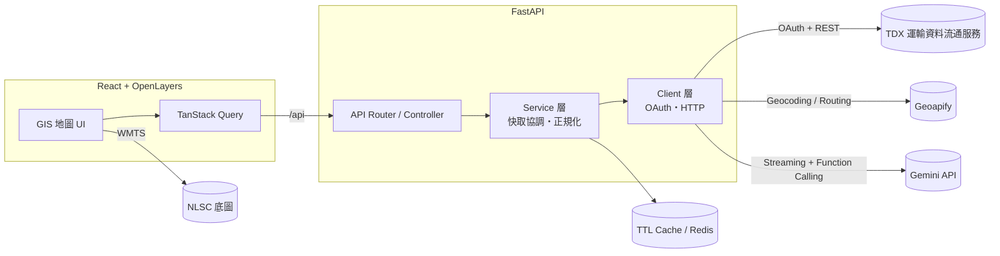

# RouteSight 路況觀測站

[](https://github.com/Mmm44556/road-status-analytics/actions/workflows/ci.yml)

全臺即時交通 GIS，整合路況、道路事件、CCTV、公車、YouBike、捷運與停車資訊，並內建 AI 路線助理——用日常語言下指令，AI 會直接呼叫地圖操作（選取範圍、切換底圖、規劃路線）而不是只回一段文字。前端只呼叫本專案的 FastAPI 後端，TDX／Geoapify／Gemini 的憑證、OAuth token 與快取皆由後端集中管理，瀏覽器端不會接觸任何金鑰。

- <a href="#demo">畫面預覽</a>
- <a href="#tools">技術棧</a>
- <a href="#features">系統特色</a>
- <a href="#architecture">系統架構</a>
- <a href="#env">環境設定</a>
- <a href="#install">安裝與啟動</a>
- <a href="#docker">用 Docker 跑</a>
- <a href="#test">驗證</a>
- <a href="#structure">專案結構</a>
- <a href="#data-sources">資料來源</a>
- <a href="#roadmap">已知限制與規劃中項目</a>
- <a href="#faq">開發心得(FAQ)</a>

<h2 id="demo">畫面預覽 ( Demo )</h2>

<!--
  以下為畫面素材的預留位置，尚未放入實際截圖／GIF。
  建議尺寸：首頁截圖 1600x900 以上；GIF 寬度 900~1200px、控制在 10 秒內、循環播放。
  檔案請放在 .github/screenshots/ 底下，並把下面的路徑換成實際檔名即可。
-->

<h3>1. 首頁：全臺地圖、圖層選單與圖例</h3>

`.github/screenshots/home.png`

<h3>2. 選擇縣市／鄉鎮，交通圖層才依範圍啟用查詢</h3>

`.github/screenshots/area-selection.gif`

<h3>3. AI 路線助理：對話直接觸發地圖操作</h3>

`.github/screenshots/ai-assistant.gif`

<h3>4. 路線規劃：多途經點與沿途事件分析</h3>

`.github/screenshots/route-planner.gif`

<h2 id="tools">技術棧 ( Tools )</h2>

**前端:** React 19、TypeScript、Vite、OpenLayers 10、MUI 7、TanStack Router、TanStack Query、Zod、GSAP

**後端:** FastAPI、Pydantic、requests、Redis（選配，未設定時自動退回程序內快取）

**AI／資料整合:** Gemini API（function calling 結構化地圖指令）、Geoapify（地點搜尋與路徑規劃）、TDX 運輸資料流通服務、NLSC 國土測繪中心 WMTS 底圖

**容器化:** Docker、docker-compose（nginx 服務前端靜態檔並反向代理 /api、FastAPI 後端、Redis）

**測試:** Vitest（前端 238 個測試）、pytest（後端單元測試）、ESLint、TypeScript 嚴格模式

**版本管理:** Git

<h2 id="features">系統特色 ( Features )</h2>

- **行政區驅動查詢**：先選縣市／鄉鎮才會對交通 API 發出請求，避免進站就打滿 9 種圖層的 API；切換行政區會即時篩選圖層資料範圍並清除舊的選取狀態。
- **9 種即時交通圖層**：即時路況、道路事件、CCTV 路口影像（含 HLS／mpegts 直播串流）、車輛偵測器（VD）、YouBike、捷運、公車即時到站、路邊停車格、路外停車場，皆可獨立開關並各自處理 loading／error 狀態。
- **AI 路線助理**：Gemini 串流對話搭配結構化 function calling，可直接執行「選取台中市」「切換成正射影像底圖」「規劃到高鐵站的路線」等地圖操作，不是單純的問答機器人。
- **路線規劃**：地點搜尋、多途經點排序、沿途道路事件分析，找出路線上可能影響行程的事故與施工路段。
- **多顆 NLSC 底圖切換**：一般地圖、正射影像等官方底圖即時切換。
- **具協調機制的 TTL 快取**：同一資源的併發請求會合併成一次上游呼叫，並提供可觀測性統計端點（開發限定）。
- **錯誤邊界與 404 頁面**：地圖區塊發生未預期例外不會拖垮全站；路由 404 沿用導覽列版面而非空白頁。
- **RWD**：手機版圖層選單收合成單一按鈕、以底部 Drawer 呈現，桌面版維持錨定式選單。

<h2 id="architecture">系統架構 ( System Architecture )</h2>



前端不直接持有任何第三方金鑰；所有需要憑證的請求都經過後端 Client 層代理。後端採 Router → Service → Client 分層：Router 只處理 HTTP 與參數驗證，Service 負責與 HTTP 無關的應用邏輯（正規化、快取協調），Client 專責外部服務的認證與 HTTP 呼叫。

<h2 id="env">環境設定 ( Environment )</h2>

```bash
cp .env.example .env
```

必填（TDX 道路事件、CCTV、公車等圖層皆依賴此憑證）：

```env
TDX_CLIENT_ID=your-client-id
TDX_CLIENT_SECRET=your-client-secret
```

選配（未設定對應功能會自動關閉，不影響其餘圖層）：

```env
# 地點搜尋與路線規劃
GEOAPIFY_API_KEY=

# AI 路線助理
GEMINI_API_KEY=

# 共用快取；留空則使用程序內記憶體快取
REDIS_URL=
CACHE_NAMESPACE=roadmap:v1
```

開發時如需查看 TDX 與快取累計值，可另外啟用：

```env
ENABLE_SYSTEM_STATS=true
```

啟用後可由前端開發網址查詢 `/api/system/cache-stats`。此端點預設關閉，正式環境不應在沒有管理員驗證的情況下開啟；統計資料會在後端重啟後歸零。

不要將 `.env` 或憑證提交至 Git。

<h2 id="install">安裝與啟動 ( Install & Run )</h2>

### 前端

```bash
npm install
```

### 後端

```bash
python3 -m venv .venv
source .venv/bin/activate
python -m pip install -r server/requirements.txt
```

### 啟動

終端一：

```bash
source .venv/bin/activate
python -m uvicorn server.main:app --reload --host 127.0.0.1 --port 8000
```

終端二：

```bash
npm run dev -- --host 127.0.0.1
```

前端開發伺服器會將 `/api` 代理至 `http://127.0.0.1:8000`。

FastAPI 文件：`http://127.0.0.1:8000/docs`　健康檢查：`http://127.0.0.1:8000/health`

<h2 id="docker">用 Docker 跑 ( Docker )</h2>

不想裝 Node／Python 環境的話，可以直接用 Docker 跑起整個系統。這是**正式環境風格**的容器（nginx 服務 build 好的前端靜態檔＋反向代理、後端不開 `--reload`），不是開發用的熱重載環境——改前端程式碼要重新 `docker compose up --build` 才會生效。

```bash
cp .env.example .env
# 編輯 .env，至少填入 TDX_CLIENT_ID／TDX_CLIENT_SECRET
# （GEOAPIFY_API_KEY／GEMINI_API_KEY 沒填，對應的路線規劃／AI 助理功能會自動關閉，其餘圖層不受影響）

docker compose up --build
```

啟動後：

- 前端：`http://localhost:8080`
- 後端 API 文件：容器內部埠 `8000`，預設沒有對外開放；要除錯的話可用 `docker compose exec backend curl http://localhost:8000/health` 或暫時在 `docker-compose.yml` 的 `backend` 服務加上 `ports: ["8000:8000"]`。

架構：`frontend`（nginx）→ `backend`（FastAPI，`REDIS_URL` 由 compose 覆蓋成容器網路內的 `redis://redis:6379/0`，不會用到 `.env` 裡本機開發用的位址）→ `redis`。三個服務都設了 healthcheck，`frontend` 會等 `backend` 通過健康檢查才啟動，`backend` 會等 `redis` 通過才啟動。

停止：

```bash
docker compose down        # 保留 Redis 資料
docker compose down -v     # 連 Redis 資料一起清掉
```

<h2 id="test">驗證 ( Testing )</h2>

```bash
npm test
npm run lint
npm run build
source .venv/bin/activate
python -m pytest server/tests
```

<h2 id="structure">專案結構 ( Project Structure )</h2>

```text
src/
├── routes/-maps/         GIS 頁面、圖層選單、AI 聊天面板、路線規劃卡片
├── service/map/          OpenLayers controller、Feature 轉換、底圖與行政區遮罩
│   └── layers/            各圖層資料 hook（bike／cctv／metro／vd…）
├── service/               各領域 API client（trafficApi、routeApi、aiChatApi…）
├── data/                  圖層定義、行政區界線 TopoJSON
└── config/                主題、語意色彩、design tokens

server/
├── api/routes/            FastAPI HTTP routers／controllers
├── services/               應用邏輯、快取協調、AI 對話流程
├── clients/                TDX OAuth、Geoapify、Gemini 的 HTTP 呼叫
├── schemas/                Pydantic API 契約
├── core/                    環境設定
└── tests/                   後端單元測試
```

<h2 id="data-sources">資料來源 ( Data Sources )</h2>

- [TDX 運輸資料流通服務](https://tdx.transportdata.tw/) — 交通部：道路事件、CCTV 路口影像、車輛偵測器（VD）、即時路況、YouBike、公車即時到站、捷運、路邊／路外停車場
  - [TDX 道路事件 v1](https://tdx.transportdata.tw/api-service/swagger/basic/60abfa19-ffe3-4eef-a4b1-0539435dfca9)
  - [TDX 基礎服務總覽](https://tdx.transportdata.tw/data-service/basic)
- [國土測繪中心（NLSC）WMTS 底圖](https://maps.nlsc.gov.tw/) — 一般地圖、正射影像等官方底圖圖磚
- [Geoapify](https://www.geoapify.com/) — 地點搜尋（Geocoding）與路線規劃（Routing）
- [Gemini API](https://aistudio.google.com/apikey)（Google）— AI 路線助理的串流對話與 function calling
- 行政區界線（22 縣市／368 鄉鎮）— 封裝於 `src/data/` 的本地 TopoJSON，非即時 API 查詢

<h2 id="roadmap">已知限制與規劃中項目</h2>

- `gemini_client.py`、`road_event_service.py` 與部分前端純函式（`wkt.ts`、`countySelectionPresentation.ts`）尚無專屬測試。
- Production bundle 仍是單一主 chunk（約 1.1MB），尚未做路由層級的 code-splitting。
- 尚無正式對外部署與線上 Demo 連結；本機可用 <a href="#docker">Docker</a> 跑起正式環境風格的版本。

<h2 id="faq">開發心得 ( FAQ )</h2>

#### 為什麼要做這個專案？

想做一個不只是「畫圖層」的交通 GIS：一般交通地圖把圖層開關、行政區選擇、路線規劃這些操作都丟給使用者自己組合，這個專案想驗證的是——用 LLM function calling 讓 AI 直接操作地圖狀態（而不是只回文字建議）可以到什麼程度，同時把 TDX、Geoapify、Gemini 這幾個真實外部服務的認證、降級與快取整合進同一套後端。

#### 開發過程中遇到的困難？

- **AI 指令與地圖狀態同步**：AI 回傳的結構化指令（選取範圍、切換底圖）必須跟使用者手動操作共用同一套狀態機，避免 AI 動作與使用者操作互相覆蓋或留下不一致的中間狀態。
- **多圖層的 loading／error 語意**：9 種圖層各自獨立開關、各自打 API，需要一致的 disabled／loading／error 呈現規則，而不是每個圖層各寫一套。
- **快取一致性**：多個使用者或多個圖層同時對同一個縣市發request時，要合併成一次上游呼叫而不是重複打 TDX，因此設計了具協調機制的 TTL 快取。

#### 這個系統目前還有什麼不足？

有，最明顯的是自動化程度不夠：沒有 CI，部分後端 client 與前端純函式還缺測試，這些都記錄在上面的<a href="#roadmap">已知限制</a>裡，不是没意識到，而是先把使用者能感知到的功能做完整，這類工程基礎建設排在下一輪要補的項目。

## 作者

- [@Mmm44556](https://www.github.com/Mmm44556)
