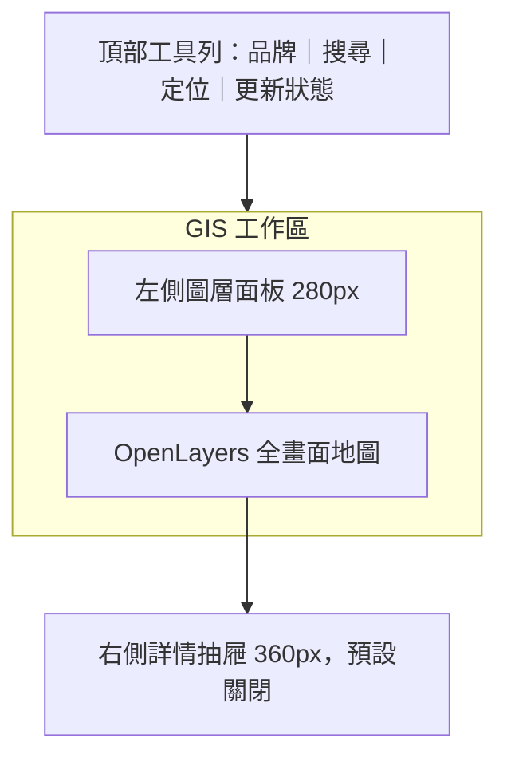

# GIS 第一階段：單頁地圖與交通圖層規格

## 1. 階段目標

第一階段只完成可操作的單頁 GIS 與圖層框架，不整合 AI、路線規劃或分析儀表板。

使用者進入網站後，應能：

1. 看到全畫面地圖。
2. 搜尋地點或回到目前位置。
3. 從左側面板切換交通圖層。
4. 查看地圖點位、Cluster 與詳細資訊。
5. 看見資料來源、更新時間、載入與錯誤狀態。

## 2. 參考畫面取捨

保留參考畫面的核心操作模式，但不複製其品牌、Google 底圖或所有周邊功能。

### 保留

- 地圖佔滿主要畫面。
- 頂部搜尋與定位操作。
- 左側垂直圖層面板。
- 點擊圖層後在地圖繪製資料。
- 點擊標記開啟詳情。
- 大量點位使用 Cluster。

### 第一階段省略

- 公共運輸、停車與外部連結頂部分類。
- 右側景點監控清單。
- AI 對話與路線規劃。
- 交通績效與資訊可變標誌。
- 與目前四項需求無關的圖層。

## 3. 桌面版面



- 頂部工具列固定，高度約 56 至 64px。
- 左側面板可收合，展開寬度約 280px。
- 地圖填滿剩餘視窗，不產生頁面捲動。
- 詳情抽屜只有在選取要素時出現，不永久佔據地圖。
- 搜尋欄屬於產品本身，不直接複製「搜尋 Google 地圖」文字。

## 4. 行動版面

- 地圖維持全畫面。
- 搜尋欄固定於頂部，定位為獨立圖示按鈕。
- 圖層面板改為底部抽屜。
- 要素詳情使用同一個底部抽屜，不能與圖層面板同時開啟。
- 觸控目標至少 44px，地圖縮放與按鈕不互相遮擋。

## 5. 第一階段圖層

| 畫面名稱 | 資料對應 | TDX 判斷 | 第一階段處理 |
| --- | --- | --- | --- |
| 360 路口 | 360° 路口全景影像 | 未在 TDX 官方路況 API 目錄找到獨立標準資料集 | 保留關閉或「資料來源待確認」，不使用假資料 |
| 路口影像 | CCTV 設備與影像連結 | 有，路況資訊 v2；影像連結僅提供會員使用 | 建立圖層與詳情介面，介接前確認公開展示條件 |
| 交通事件 | 縣市、省道與高速公路道路事件 | 有，道路事件 v1 | 優先介接，沿用後端憑證與快取 |
| 車輛偵測器 | VD 設備與即時偵測資料 | 有，路況資訊 v2，包含縣市、省道與高速公路類別 | 建立設備點位與即時數值詳情 |

### 5.1 TDX 結論

- **交通事件：可用。** TDX 道路事件 v1 提供縣市、省道及高速公路分類。
- **路口影像：可用但有限制。** TDX 路況資訊 v2 包含 CCTV；官方明確說明影像連結僅提供會員使用。公開網站仍需驗證連結授權、有效期、CORS 與嵌入方式。
- **車輛偵測器：可用。** TDX 路況資訊 v2 包含 VD，且有縣市、省道及高速公路路況分類。實際點位覆蓋依資料供應單位而異。
- **360 路口：TDX 未確認。** 官方路況資訊列出 VD、CMS、CCTV、AVI，未列出獨立 360° 路口全景服務。需另外找地方政府資料來源或取得高雄服務授權。

## 6. 圖層互動規則

### 共通規則

- 圖層項目使用開關或核取方塊，不以整列切換選取狀態。
- 每個圖層顯示載入中、可用、部分可用、錯誤或待確認狀態。
- 圖層資料必須標示最後更新時間與來源。
- 切換圖層不重建 OpenLayers Map instance。
- 使用者移動或縮放地圖後，以目前視野範圍載入資料。
- 請求需 debounce，舊請求結果不得覆蓋較新的地圖視野。

### Cluster

- 交通事件、CCTV 與 VD 點位預設支援 Cluster。
- Cluster 顯示數量；不能只靠顏色表達資料類型。
- 點擊單一點位開啟詳情。
- 點擊含多個點位的 Cluster，先放大至可分辨範圍；若已到最大層級，再顯示成員清單。
- 圖層各自 Cluster，避免不同資料類型聚成一個無法理解的數字。

## 7. 圖層詳情

### 交通事件

- 事件類型、標題、道路名稱、影響方向。
- 發生時間、預計結束時間與最後更新。
- 來源與資料新鮮度。

### 路口影像

- 攝影機名稱或位置、方向及狀態。
- 影像、縮圖或外部連結。
- 影像不可用、連結過期或無權限的明確提示。
- 來源與更新時間。

### 車輛偵測器

- VD 名稱、道路、方向與設備狀態。
- 各車種可用的流量、速度或佔有率資訊。
- 資料觀測時間，不將設備位置資料誤標成即時數值。
- 缺值以「未提供」顯示，不以 0 代替。

## 8. 視覺方向

- 整體使用低干擾的中性色介面，讓地圖與交通狀態成為主角。
- 主品牌色使用藍綠色系，但不大面積覆蓋底圖。
- 事件、CCTV、VD 各有固定語意圖示與顏色。
- 圖層面板使用清楚分隔與緊湊密度，不做大型 Dashboard 卡片。
- 所有狀態同時使用圖示、文字及色彩，符合 WCAG 2.1 AA。
- 不直接仿製參考站的圖示、品牌配色或受保護素材。

## 9. 前端元件規劃

```text
src/routes/maps/
  route.tsx                  單頁 GIS route
  TrafficMapPage.tsx         頁面組合與版面
  components/
    MapToolbar.tsx           搜尋、定位與更新狀態
    LayerPanel.tsx           圖層清單與狀態
    LayerToggle.tsx          單一圖層控制
    FeatureDetailDrawer.tsx  要素詳情容器
    EventDetail.tsx          事件內容
    CameraDetail.tsx         CCTV 內容
    DetectorDetail.tsx       VD 內容
```

地圖物件、Feature 轉換、Style 與 Cluster 邏輯維持在 `src/service/map/`，UI 元件不直接管理 OpenLayers 圖層生命週期。

## 10. GIS 核心狀態

```ts
type LayerId = 'PANORAMA_360' | 'CCTV' | 'ROAD_EVENT' | 'VD';

type LayerAvailability =
  | 'AVAILABLE'
  | 'PARTIAL'
  | 'LOADING'
  | 'ERROR'
  | 'SOURCE_PENDING';

interface TrafficLayerState {
  id: LayerId;
  isVisible: boolean;
  availability: LayerAvailability;
  featureCount: number;
  observedAt?: string;
  fetchedAt?: string;
  sourceLabel?: string;
}
```

## 11. 實作切片

### 切片 A：靜態版面與地圖殼層

- 全畫面單頁版面。
- 頂部工具列、搜尋欄、定位按鈕。
- 可收合圖層面板與詳情抽屜。
- OpenLayers 底圖與響應式尺寸。

### 切片 B：圖層框架

- `LayerId` 與圖層狀態。
- 圖層開關、圖例、載入與錯誤狀態。
- 共用 VectorSource／Cluster 管理。
- 點擊、選取與詳情抽屜。

### 切片 C：交通事件

- 介接現有後端 TDX 道路事件。
- 視野範圍查詢、Cluster 與事件詳情。
- 空資料、過期資料與 API 錯誤狀態。

### 切片 D：CCTV

- 確認會員 API 與公開展示條件。
- 介接攝影機設備點位。
- 影像可用性與詳情呈現。

### 切片 E：VD

- 介接 VD 設備與即時資料。
- 依設備 ID 合併靜態位置與即時觀測。
- 顯示速度、流量、方向及觀測時間。

### 暫緩：360 路口

- 在取得正式資料集、授權與格式前不介接。
- 可在 UI 隱藏，或以停用狀態標示「資料來源待確認」。

## 12. 驗收標準

- 320、768、1024、1440px 寬度皆可使用核心 GIS 功能。
- 地圖填滿可用視窗且面板不造成頁面橫向捲動。
- 圖層可獨立開關，不會重建地圖或重複註冊事件。
- 交通事件、CCTV、VD 大量點位皆可 Cluster。
- 點選單一 Feature 能開啟正確類型的詳情。
- 視野快速變更時不會被舊 API 回應覆蓋。
- 載入、空資料、錯誤、過期與權限不足都有畫面。
- 鍵盤可操作搜尋、定位、圖層與關閉詳情。
- 第一階段不包含 AI 程式碼或假的 360° 資料。

## 13. 邊界

### 一律執行

- 使用 OpenLayers 10.10 現有地圖架構。
- 所有 TDX 憑證保留於 FastAPI 後端。
- 驗證外部回應、座標與時間。
- 保留資料來源與更新時間。
- 先寫可測試的圖層轉換與控制邏輯。

### 實作前確認

- CCTV 是否允許在公開網站直接嵌入或需導向來源。
- 360° 路口的正式資料來源與授權。
- 第一個預設城市與底圖風格。

### 禁止

- 複製參考網站的商標、圖示或 Google 底圖素材。
- 在瀏覽器暴露 TDX Client Secret。
- 將 mock 標成即時資料。
- 以「0」取代未提供的交通偵測值。

## 14. 官方資料參考

- [TDX 路況資訊 v2：VD、CMS、CCTV、AVI](https://tdx.transportdata.tw/api-service/swagger/basic/7f07d940-91a4-495d-9465-1c9df89d709c)
- [TDX 道路事件 v1](https://tdx.transportdata.tw/api-service/swagger/basic/60abfa19-ffe3-4eef-a4b1-0539435dfca9)
- [TDX 基礎服務](https://tdx.transportdata.tw/data-service/basic)

---

本規格核准後才進入切片 A。每完成一個切片並通過驗收，再決定是否進入下一個資料圖層。
