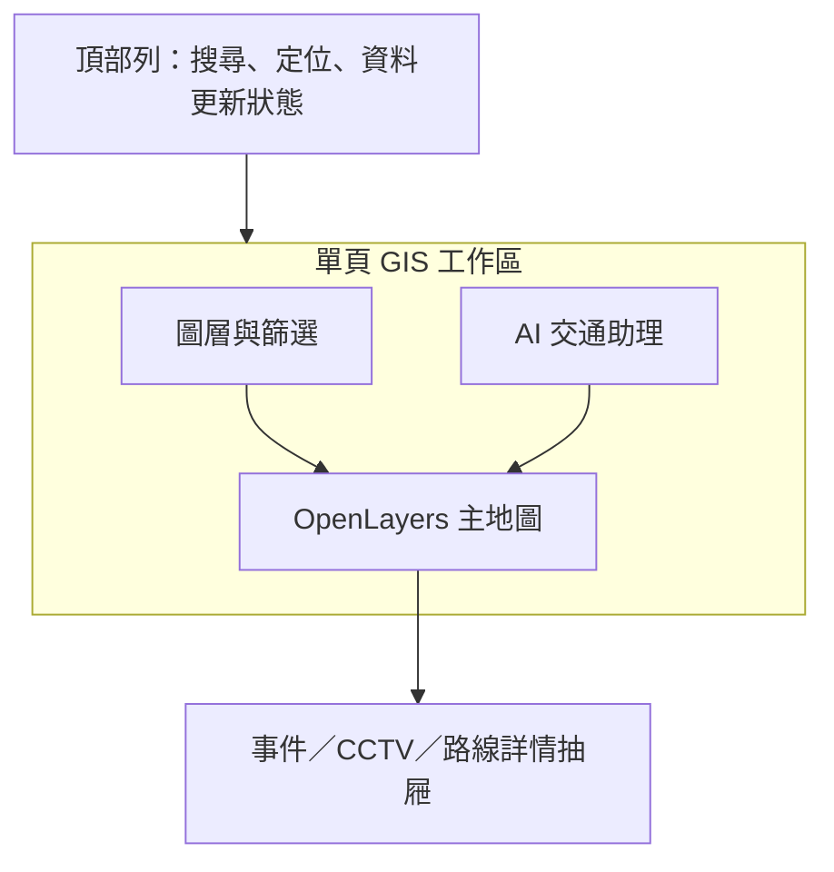
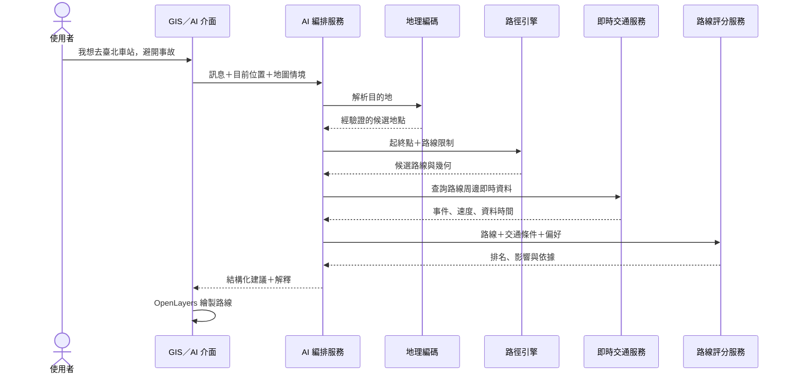
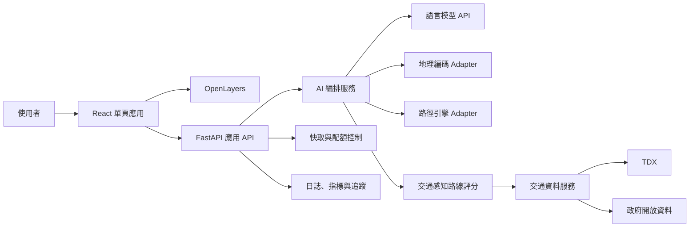

# 路況通：AI GIS 交通服務產品與系統規格

> 一個以 GIS 地圖為核心，讓使用者用自然語言查詢即時交通並取得可解釋路線建議的交通服務。

## 1. 方向調整

本專案從「所在地交通簡報、全臺地圖與歷史分析」多頁產品，調整為單一首頁 GIS 服務。

新產品保留一般交通 Web GIS 的基礎能力，例如定位、地點搜尋、即時路況、道路事件、CCTV、停車與圖層控制；主要差異是加入 AI 交通助理。使用者可以直接輸入：

> 我現在想去臺北車站，希望避開事故路段，也不要走高速公路。

系統理解目的地及偏好後，取得可行候選路線，結合當前交通資料評估，說明推薦理由，並由 GIS 在地圖上繪製路線。

## 2. 核心架構原則

AI 不負責自行「發明」路線，也不直接生成道路座標。

- **AI 負責**：理解自然語言、補足必要條件、轉換路線偏好、呼叫工具、比較候選方案與解釋建議。
- **地理編碼服務負責**：把地址或地標解析成可驗證座標，並提供候選地點。
- **路徑引擎負責**：依道路網計算合法候選路線、距離、時間與路線幾何。
- **交通資料服務負責**：提供事件、壅塞、道路速率、封閉與資料時間。
- **決策服務負責**：將候選路線與交通資料疊合、評分並留下可追溯結果。
- **OpenLayers 負責**：繪製路線、事件、路況與互動狀態。

此分工避免語言模型幻覺造成不存在的道路、錯誤座標或不可行轉向。

## 3. 系統目的

### 使用者價值

- 打開首頁即可查看所在地附近的即時交通資訊。
- 不熟悉圖層或交通術語，也能用日常語言提出需求。
- 可依「避開事故、少走壅塞、不要高速公路」等條件取得建議。
- 每次建議都顯示資料時間、採用條件與推薦原因。
- 可在同一張地圖查看事件、CCTV 並切換候選路線。

### 作品集價值

- OpenLayers GIS、Cluster、路線幾何與空間互動。
- TDX 等真實資料的認證、清理、快取與降級。
- LLM tool calling、結構化輸出與防幻覺邊界。
- 地理編碼、路徑引擎、即時交通和 AI 的系統整合。
- 公開服務所需的隱私、安全、成本與可觀測性。

## 4. 目標使用者與核心情境

主要使用者是一般駕駛，尤其是想快速掌握路況、前往不熟悉地點，或希望依個人偏好避開特定道路狀況的人。

1. **瀏覽路況**：定位後查看附近事故、施工、壅塞與 CCTV。
2. **搜尋地點**：輸入地址或地標，查看目的地周邊交通。
3. **AI 規劃路線**：用自然語言描述目的地與行車偏好。
4. **比較方案**：查看推薦、最快與替代路線的差異。
5. **追問調整**：例如「不要走國道」「改從公司出發」「避開這個事故」。

## 5. 與既有交通 Web GIS 的差異

| 面向 | 常見交通 Web GIS | 本系統 |
| --- | --- | --- |
| 主要介面 | 地圖、圖層與資訊窗 | 地圖、圖層加 AI 對話 |
| 操作方式 | 使用者自行找資料並判讀 | 直接描述目的地與限制 |
| 路線能力 | 通常以顯示路況為主 | 候選路線套用即時交通偏好 |
| 資訊理解 | 依圖層或設備類型 | AI 將需求轉成可執行條件 |
| 結果 | 顯示資料，由使用者判斷 | 提供推薦、替代方案與理由 |
| 可追溯性 | 來源與更新時間 | 加上推薦依據與評分版本 |

核心差異不是在政府 GIS 上加一個聊天視窗，而是讓 AI 成為 GIS 的操作入口；所有結論仍由真實資料與確定性工具支撐。

## 6. 單頁資訊架構

產品只有一個主要頁面。桌面版採「左側圖層／中央地圖／右側 AI」結構；手機版使用全畫面地圖搭配可收合底部面板。



### 頂部列

- 品牌、地址／地標搜尋、使用目前位置。
- 資料最後更新時間與服務狀態。
- 行動版圖層與 AI 入口。

### 地圖主畫面

- 底圖、道路事件與 Cluster。
- 路況／道路速度、CCTV、停車等按需圖層。
- 起點、終點、途經點、主路線與替代路線。
- 圖例、比例尺、定位及要素詳情。

### AI 交通助理

- 對話輸入與建議問題。
- 起點、終點及偏好確認卡。
- 推薦路線摘要、替代方案與受影響事件。
- 資料時間、推薦理由與降級提示。
- 顯示路線、切換方案、重新規劃、清除路線。

## 7. AI 路線助理流程



AI 可處理規劃路線、修改起終點、避開事故／施工／壅塞／高速公路、比較候選方案，以及控制地圖圖層。若地名有歧義、缺少起點、資料過期或條件互相衝突，必須先向使用者確認或明確降級。

## 8. 整體系統架構



### 系統邊界

- 外部服務憑證只存在後端。
- 前端不直接呼叫 LLM、TDX 或需私密憑證的路徑服務。
- 外部 API 回應一律驗證格式、座標與時間。
- LLM 只能呼叫允許清單內的工具，不能執行任意 URL、SQL 或程式碼。
- 路線幾何只接受路徑引擎回傳並通過驗證的 GeoJSON／Polyline。
- AI 文字不能覆寫系統規則、資料來源或確定性評分結果。

## 9. 系統模組規劃

| 模組 | 責任 | 輸入 | 輸出 | 優先度 |
| --- | --- | --- | --- | --- |
| GIS 地圖核心 | 投影、視野、生命週期與互動 | 圖層、Feature、View state | OpenLayers 地圖 | MVP |
| 圖層管理 | 事件、路況、CCTV、停車的開關 | 設定與資料 | 可視圖層 | MVP |
| 點位聚合 | 大量事件與設備 Cluster | 點位 Feature | 聚合 Feature | MVP |
| 搜尋與地理編碼 | 地址／地標查詢及歧義處理 | 搜尋文字 | 地點候選與座標 | MVP |
| 使用者定位 | 目前位置與權限降級 | Browser Geolocation | 起點座標 | MVP |
| 道路事件 | 正規化事故、施工、封閉 | TDX／政府資料 | `RoadEvent` | MVP |
| 交通狀態 | 路段速度、壅塞與新鮮度 | VD／交通資料 | `TrafficCondition` | MVP |
| 路徑引擎 Adapter | 計算合法候選路線 | 起終點與限制 | `RouteCandidate[]` | MVP |
| 路線評分 | 依交通資料與偏好排序 | 路線、事件、速度 | `RouteAssessment[]` | MVP |
| AI 意圖解析 | 將自然語言轉成受控結構 | 對話與地圖情境 | `TrafficIntent` | MVP |
| AI 工具編排 | 呼叫地理、路線與交通工具 | `TrafficIntent` | `AssistantResult` | MVP |
| 路線繪製 | 顯示主路線、替代線與事件 | 路線幾何 | Route layers | MVP |
| CCTV／停車 | 目的地與路線周邊資訊 | TDX／地方資料 | Map Feature | 第二階段 |
| 快取與配額 | 降低外部呼叫並處理限額 | 請求與 TTL | 快取結果 | MVP |
| 可觀測性 | 工具延遲、失敗、成本與資料時間 | 系統事件 | Log、metric、trace | 上線前 |

## 10. API 與型別契約草案

### 核心端點

- `POST /api/v1/assistant/messages`：提交對話與目前地圖情境。
- `POST /api/v1/routes/preview`：以結構化條件取得候選路線。
- `GET /api/v1/places/search`：搜尋地址或地標。
- `GET /api/v1/road-events`：依範圍、類型及時間取得事件。
- `GET /api/v1/traffic-conditions`：取得視野或路線範圍交通狀態。
- `GET /api/v1/cameras`：取得攝影機點位。
- `GET /api/v1/metadata/sources`：取得來源、更新與授權資訊。
- `GET /health`：應用程式健康檢查。

```ts
interface AssistantMessageRequest {
  message: string;
  conversationId?: string;
  context: {
    currentLocation?: GeoPoint;
    mapBounds?: GeoBounds;
    selectedFeatureId?: string;
    activeLayerIds: string[];
  };
}

type AssistantResult =
  | { type: 'NEEDS_CLARIFICATION'; message: string; placeCandidates?: PlaceCandidate[] }
  | {
      type: 'ROUTE_RECOMMENDATION';
      message: string;
      recommendedRouteId: string;
      routes: RouteAssessment[];
      dataFreshness: DataFreshness[];
    }
  | { type: 'MAP_ACTION'; message: string; actions: MapAction[] }
  | { type: 'UNAVAILABLE'; message: string; reasonCode: string };

interface RouteCandidate {
  routeId: string;
  geometry: GeoJSON.LineString;
  distanceMeters: number;
  durationSeconds: number;
  restrictions: string[];
  provider: string;
}

interface RouteAssessment extends RouteCandidate {
  rank: number;
  trafficDelaySeconds?: number;
  affectedEvents: RoadEventSummary[];
  scoreBreakdown: {
    travelTime: number;
    incidentRisk: number;
    preferenceMatch: number;
  };
  explanation: string;
}
```

所有錯誤使用一致結構：`error.code`、`error.message`、`error.requestId` 與選填的 `error.details`。

## 11. 資料與供應商策略

### 交通資料

- TDX 作為道路事件、VD／路況與 CCTV 等資料的主要候選來源。
- 地方政府資料只補足 TDX 覆蓋或提供特有資訊。
- 每筆資料保留來源、觀測時間、取得時間與新鮮度。
- 公開上線前確認方案、授權與配額，不假設服務永久免費或無限額。

### 地理編碼與路徑引擎

地理編碼需支援臺灣地址與地標。路徑引擎需提供汽車候選路線、距離、預估時間、可繪製幾何及可用的道路限制。兩者分別封裝成 `GeocodingProvider` 與 `RoutingProvider`，避免 UI 綁定單一廠商。

選用自架開源引擎或商用 API 前，需比較臺灣圖資品質、即時交通能力、成本、配額、授權與維運負擔。

### AI 模型

- 使用支援結構化輸出與 tool calling 的模型。
- 只傳送完成任務必要的地點、偏好與交通摘要。
- 不把大量 GIS Feature 全部放入 prompt，先由後端空間查詢與聚合。
- 模型與供應商透過後端設定，不寫死在前端契約。

## 12. 路線推薦規則

路線排序由確定性評分函式產生，AI 只解釋結果。初始因素包含：

- 基礎預估行車時間。
- 壅塞造成的額外時間。
- 路線緩衝區內事故、施工與封閉事件。
- 使用者明確偏好，例如避開高速公路。
- 資料完整度與新鮮度。

權重需版本化並保留於程式設定；AI 不得在單次對話中自行改變規則。若即時資料不足，結果標示為「一般路線建議」，不能宣稱已避開目前壅塞。

## 13. MVP 使用者旅程

1. 使用者允許定位，或手動設定起點。
2. 地圖顯示目前範圍內道路事件與 Cluster。
3. 使用者輸入「我要去某地，避開事故」。
4. 系統解析目的地；若有歧義，先要求選擇。
5. 路徑引擎產生主路線與至少一條可用替代路線。
6. 後端取得路線周邊交通資料並完成排序。
7. AI 說明推薦路線、替代方案、受影響事件與資料時間。
8. OpenLayers 繪製路線，使用者可切換方案或修改偏好。
9. 任一外部服務失敗時明確降級，不以假資料冒充即時結果。

## 14. 分階段規劃

### 第一階段：AI 路線 MVP

- 收斂為單頁 GIS 版面。
- 完成定位、地點搜尋、事件圖層與 Cluster。
- 串接一個地理編碼服務與一個路徑引擎。
- 完成 AI 意圖解析、工具呼叫與結構化回應。
- 完成候選路線評分、地圖繪製及路線切換。
- 顯示資料來源、更新時間與降級狀態。

### 第二階段：交通資料完整度

- 加入 VD／道路速度、CCTV 與停車。
- 改善路線周邊事件的空間比對與方向判斷。
- 加入「目的地附近停車」與多輪修改路線。
- 完成手機版完整操作。

### 第三階段：公開服務成熟度

- 使用量限制、成本監控與濫用防護。
- 評估自架路徑引擎或替代供應商。
- 匿名品質回饋、完整監控與災難降級。

## 15. 明確不做

- MVP 不提供逐轉導航、語音導航或背景持續定位。
- 不保證到達時間，也不定位為正式導航產品。
- AI 不直接生成、修改或補完道路幾何。
- AI 不可自由瀏覽任意網站或執行未核准工具。
- 不將歷史或快取資料冒充即時交通資料。
- 不建立獨立分析頁、排行榜或大型儀表板。
- 不提供救災、警政或緊急應變決策保證。

## 16. 隱私、安全與公開服務要求

- 精確位置只在完成任務所需期間使用，預設不永久保存。
- 若保存對話，需定義期限、刪除方式與隱私說明。
- 日誌不記錄完整精確位置、完整對話或服務憑證。
- 工具參數使用 schema 驗證並限制地點數、距離與範圍。
- 外部資料文字只視為資料，不視為指令，防止 prompt injection。
- 對話與工具呼叫需有速率限制、逾時與最大成本。
- 路線結果顯示資料時間及「仍應遵循現場標誌」聲明。

## 17. 非功能需求

### 效能與體驗

- 地圖先可操作，再載入非必要圖層與 AI 模組。
- 事件使用 Cluster、視野查詢及分批更新。
- 地圖以外提供文字版路線與事件摘要。
- 路線使用名稱、線型與標記區分，不只依賴顏色。
- 手機版面板不可同時遮住整張地圖。

### 可觀測性

- 每次路線請求建立 request ID 與跨服務 trace。
- 記錄地理編碼、路徑、TDX、評分與 LLM 的延遲和失敗率。
- 記錄 token、API 使用量與估算成本，但不記錄敏感內容。
- 監控交通資料新鮮度與最後成功更新時間。

## 18. 成功條件

- 可從目前位置或手動起點規劃至唯一目的地。
- AI 可解析「避開事故」與「不要走高速公路」等至少兩種偏好。
- 地圖能繪製主路線與至少一條可用替代路線。
- 路線卡顯示距離、時間、受影響事件、推薦理由與資料時間。
- 地名有歧義時會要求確認，不擅自選擇。
- 外部 API 或即時資料失敗時不顯示假成功。
- 不存在由 LLM 直接生成的未驗證路線幾何。
- 可追蹤每次推薦的供應商、交通資料時間與評分版本。
- 公開上線前具備速率限制、成本上限與降級機制。

## 19. 主要風險

| 風險 | 影響 | 因應方向 |
| --- | --- | --- |
| AI 誤解地名或偏好 | 規劃錯誤目的地 | 候選地點確認、結構化意圖 |
| AI 幻覺路線 | 不存在或不可行道路 | 幾何只接受路徑引擎結果 |
| 即時資料覆蓋不足 | 推薦理由不可靠 | 顯示覆蓋與新鮮度並降級 |
| 路徑服務成本或授權改變 | 公開服務受限 | Provider adapter 與替代方案 |
| TDX 配額或欄位異動 | 圖層與評分中斷 | 快取、schema 驗證與監測 |
| 位置與對話外洩 | 隱私風險 | 最小化收集與日誌去識別化 |
| Prompt injection／工具濫用 | 未授權呼叫與成本 | 白名單、驗證、限流與逾時 |
| 圖層與路線過多 | 地圖卡頓 | Cluster、按需載入與空間查詢 |

## 20. 開發規格

### 指令

```bash
npm run dev
npm run test
npm run lint
npm run build
```

後端依現有 FastAPI 設定啟動；實作計畫需補上唯一且可執行的後端開發、測試與格式化指令。

### 主要目錄

- `src/routes/`：單頁路由與頁面組合。
- `src/service/map/`：OpenLayers 控制、Feature 與圖層。
- `src/service/`：前端 API client。
- `server/api/routes/`：FastAPI 路由（Controller）與 HTTP 輸入輸出。
- `server/services/`：交通資料的應用邏輯與快取。
- `server/clients/`：TDX 等外部服務介接。
- `server/schemas/`：API 資料契約。
- `server/core/`：設定與共用基礎設施。
- `server/tests/`：後端測試。
- `docs/`：產品、架構與 API 規格。

### 邊界

- **一律執行**：先定義契約；驗證輸入及外部回應；補測試；顯示來源與時間；供應商封裝在後端。
- **實作前確認**：地理編碼、路徑及 AI 供應商；新增付費服務或資料庫；保存位置或對話；帳號與逐轉導航。
- **禁止**：提交密鑰；前端暴露憑證；將 LLM 文字當路線幾何；用假資料冒充即時結果。

## 21. 待決策事項

以下選擇不妨礙先設計畫面與契約，但會阻礙真實 AI 路線功能上線：

1. 地理編碼服務：臺灣地址品質、授權、配額與快取限制。
2. 路徑引擎：自架開源引擎或商用 API。
3. AI 模型：供應商、模型、單次成本上限與資料保留設定。
4. 交通評分：事件嚴重度、路線緩衝範圍與權重。
5. 服務範圍：全臺或先以特定縣市驗證。
6. TDX 是否能提供足夠一致的路線層級即時判斷。

## 22. 參考來源

- [TDX 運輸資料流通服務 API](https://tdx.transportdata.tw/api-service/swagger/basic/7f07d940-91a4-495d-9465-1c9df89d709c)
- [TDX 基礎服務說明](https://tdx.transportdata.tw/data-service/basic)
- [政府資料開放平臺：省道即時交通資料](https://data.gov.tw/dataset/161171)
- [新北市即時交通資訊網](https://atis.ntpc.gov.tw/?lang=zh-TW)
- [臺南市即時交通資訊網](https://tntcc.tainan.gov.tw/)
- [高雄市即時交通資訊服務網](https://traffic.tbkc.gov.tw/)

---

本文件是新產品方向的規格來源。舊的多頁總覽與歷史分析方向已由本文件取代，但保留在版本歷史中。下一步先確認第 21 節的服務選型，再建立實作計畫；規格核准前不開始大規模頁面重構。
